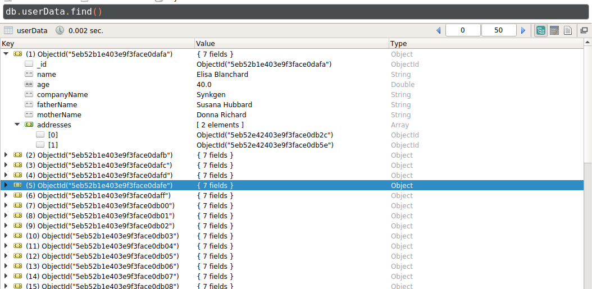
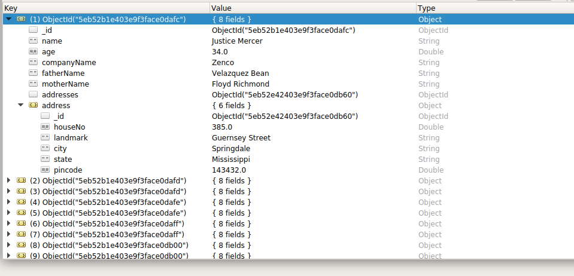
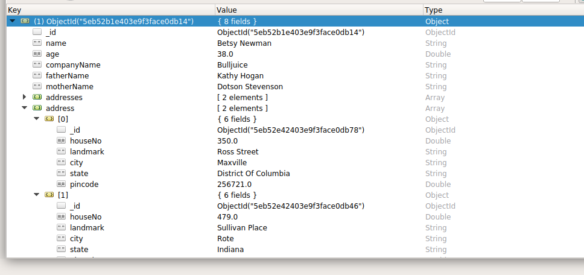
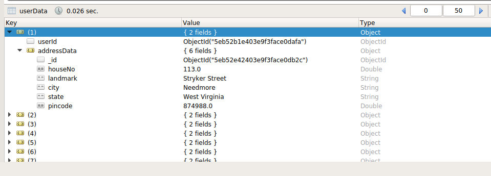
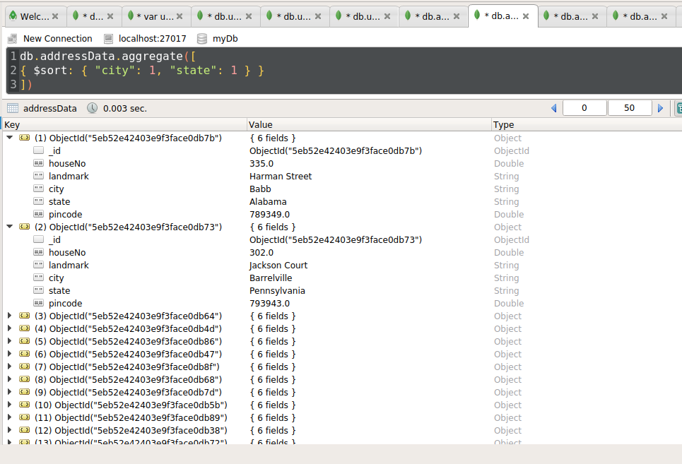

# Day7 - Aggregation Assignment
---

### Add 50 User and 100 Address Collection, One User has multiple Address.
* User properties - name, age, companyName, type, fatherName, motherName, Address ArrayIds as references.  
* Address Properties - houseNo, landmark, city, state, pincode.

> We first added 2 collection with the above mentioned fields except adding the addresses in user collection.  

**To add the address id as reference:**
```sh
var users = db.userData.find();
var address1 = db.addressData.find().limit(50);
var address2 = db.addressData.find().skip(50);

while(users.hasNext()){
    var user = users.next();
    var addr1 = address1.next();
    var addr2 = address2.next();
    
    var status = db.userData.update(
    { _id: user._id},
    { $set : {addresses: [addr1._id, addr2._id]} }
    );
}
```


### Queries

* **Write a query for to fetch all address data from address in users. Limit should be 10 and skiping first five.**  
```sh
db.userData.aggregate([
{ $unwind: "$addresses" },
{
    $lookup:
    { 
        from : "addressData",
        localField: "addresses",
        foreignField: "_id",
        as: "address"
    }
},
{ $unwind: "$address" },
{ $skip: 5}, { $limit: 10}
]);
```
  

* **Fetch & Sort User data on base of user names, Sort Address cities in User table. Limit should be 5 and skipping first 5.**
```sh
db.userData.aggregate([
{ $sort: {"name" :1 } },
{ $lookup: 
    { from: "addressData",
      let: { addressIds: "$addresses" },
      pipeline: [
      { $match:
          { $expr: 
              { $in: ["$_id", "$$addressIds"] }
          }
      },
      { $sort: { "city" : 1} }
      ],
      as: "address"
    }
},
{ $skip: 5}, { $limit: 5}
]);
```
 

* **Fetch only address selective data (UserID:””, AddressData:”” ) from user table, keys should be like above.**  
```sh
db.userData.aggregate([
{ $unwind: "$addresses" },
{ $lookup: 
    { from: "addressData",
      localField: "addresses",
      foreignField: "_id",
      as: "address"
    }
},
{ $unwind: "$address" },
{ $project: { "_id": 0, "userId": "$_id", "addressData": "$address"} } 
]);
```
 

* **Create indexes in Address table, on city and state. And Sort it.**  

**We first added Coumpound Index**
```sh
db.addressData.createIndex({ "city": 1, "state": 1})
```  
**We then sorted the addressData on basis of city and state**  
```sh
db.addressData.aggregate([
{ $sort: { "city": 1, "state": 1 } }
])
```

 

