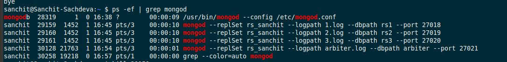
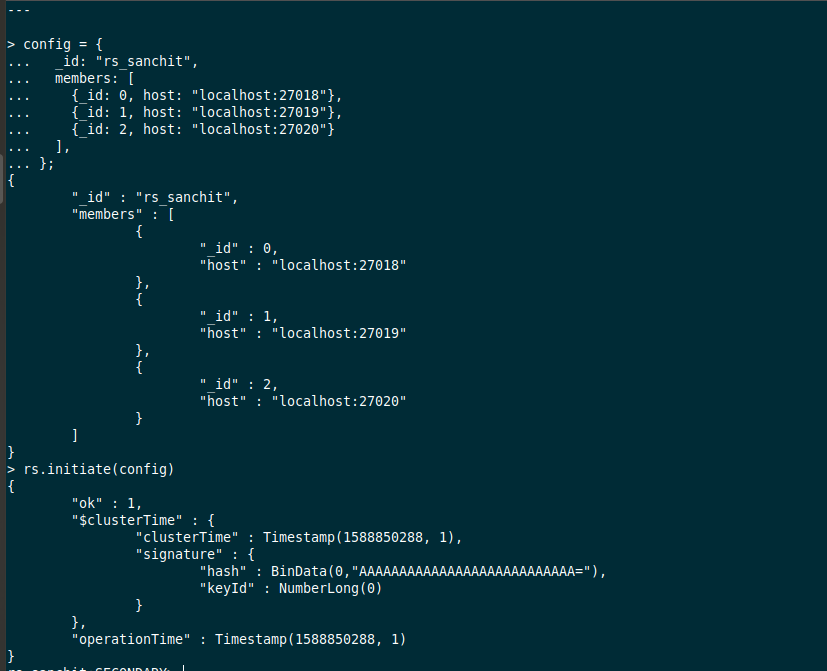
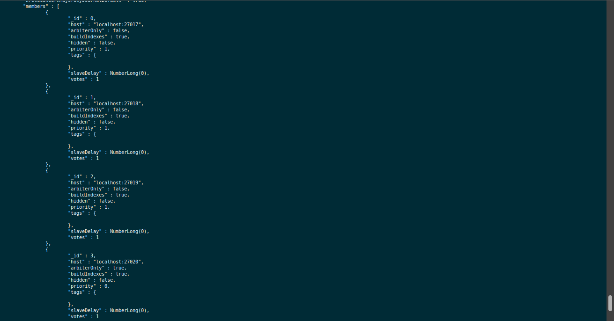
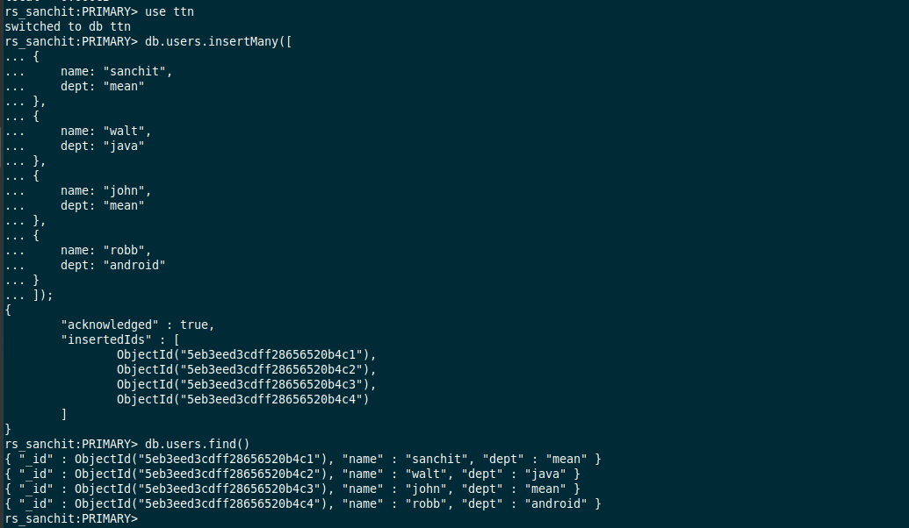
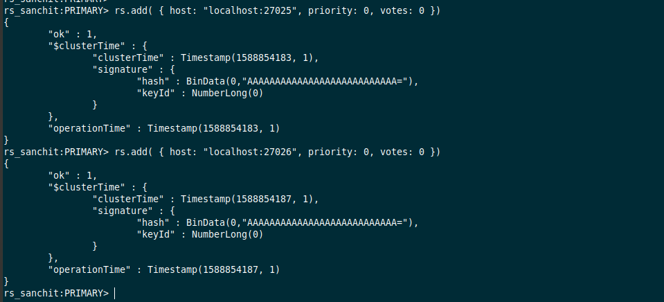
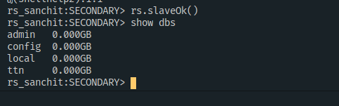

# Day7 - Advanced MongoDB   
---

**Start MongoDB without authentication**  

**Create Database ttn and insert some data into user collection.**  

**Setup the replication with Artiber and verify that ttn database is replicated into secondary.**

> We first created **3 instances** of MongoDB on port no. **27018, 27019, 27020** such that 27018 is **PRIMARY** and the other 2 are **SECONDARY**  
> We also added an instance for Arbiter on port **27020**

```sh
mkdir -p rs1 rs2 rs3

mongod --replSet rs_sanchit --logpath "1.log" --dbpath rs1 --port 27018 #PRIMARY
mongod --replSet rs_sanchit --logpath "2.log" --dbpath rs2 --port 27019 #SECONDARY
mongod --replSet rs_sanchit --logpath "3.log" --dbpath rs3 --port 27020 #SECONDARY

# Arbiter
mongod --replSet rs_sanchit --logpath "arbiter.log" --dbpath arbiter --port 27021 &
```
#### Processes
  

#### Config


#### Status
  

#### Insert data 

> Then we killed the instance for port 27017 i.e **PRIMARY** and let the mongo decide the new PRIMARY from the other 2 SECONDARY.  
> Instance at Port 27020 became the new PRIMARY and has the collection users in it already. (REPLICA)

**Add 2 more members to a replica set with**   
rs.add();  
> 2 new members were added using rs.add()



```sh
var cfg = rs.conf();
cfg.members[4].priority = 1
cfg.members[4].votes = 1

cfg.members[5].priority = 1
cfg.members[5].votes = 1

rs.reconfig(cfg);
```

**Try adding a member which already have data.**

> Another new instance of MongoDB was created without being a member of replica set.

``` sh
mongod --dbpath db1 --port 27030
```

> Then we add a collection **posts** to the database for the instance at port 27030  

> Next we added this instance to the replica set and reconfigured the replica set.  
> On starting the instance at port 27030 again, we can no longer find the **posts** collection and it only has the replica data of PRIMARY instance.


