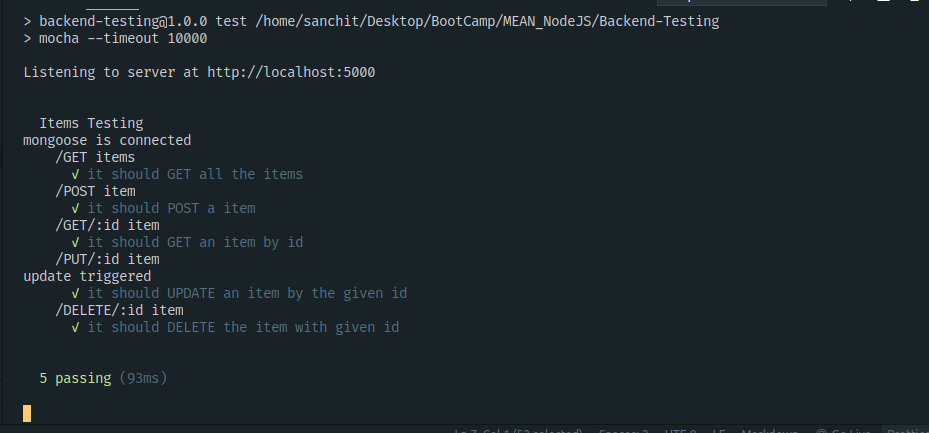

# Day10 - Test Driven Development - Backend  
---

### Add testing suite in an older project. Using the Item Model from Day6_MongooseBasics assignment.

#### EndPoints -
```sh
router.route('/items')
      .get(itemController.getAllItems)
      .post(itemController.addItem);

router.route('/item/:id')
      .get(itemController.getItem)
      .put(itemController.updateItem)
      .delete(itemController.deleteItem);
```

**Check /items folder for model, routes, controller and services**  

> ### Test Cases in /Backend-Testing/test/items.test.js

### Testing Output
