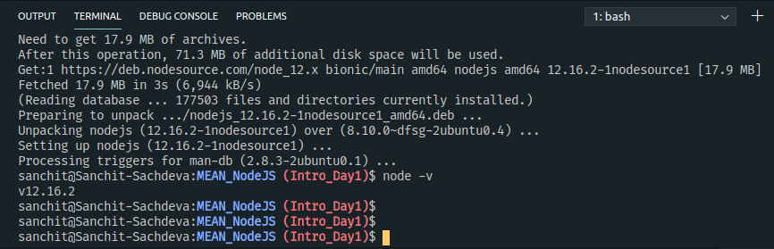
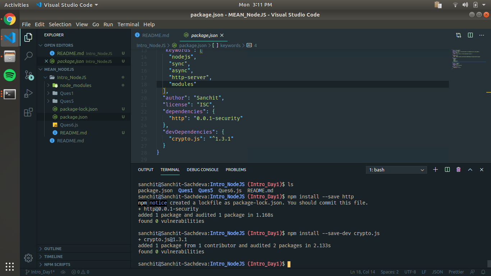
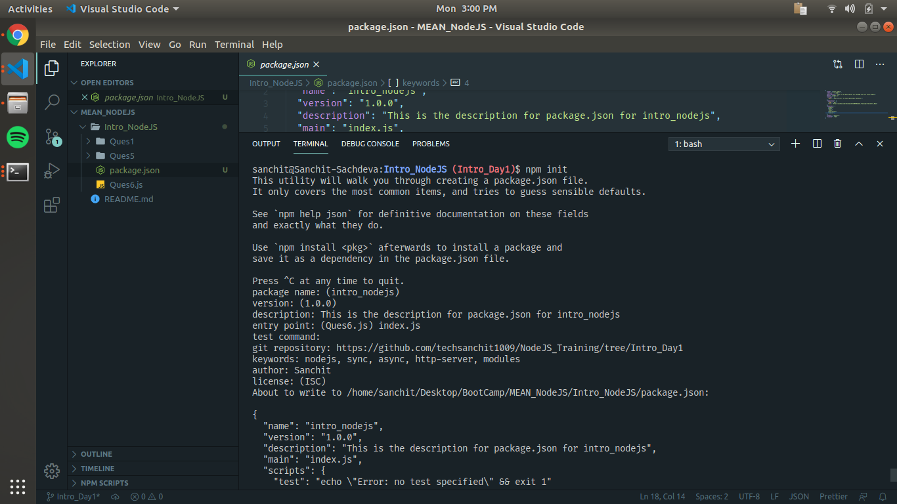
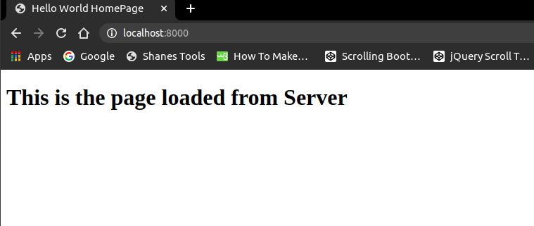

# Day1 - Intro to NodeJS and NPM
1. **Installing node latest version and npm**
  ```sh
    curl -sL https://deb.nodesource.com/setup_12.x | sudo -E bash -
    sudo apt-get install -y nodejs
  ```
  

2. **Read file asynchronously and synchronously** (Folder: /Ques2)
3. **Install dependencies and dev dependencies**
  
  * **Dependencies**
    ```sh
    npm install --save <package-name>
    ```
  
  * **Dev Dependencies**
  ```sh
    npm install --save-dev <package-name>
  ```
  
  

4. **Customizing in package.json**
  ```sh
    npm init
  ```
  

5. **Creating module and import & export** (Folder: /Ques5)


6. **Creating a http server**


