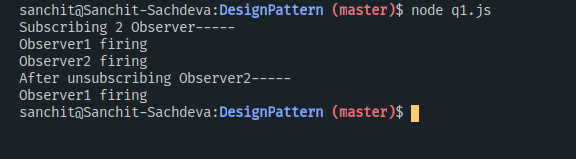
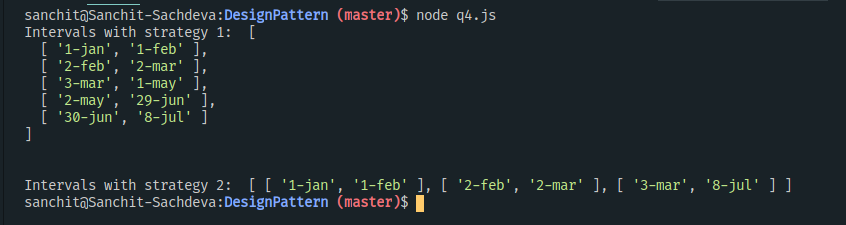

# Day9 -  Design patterns, Functional Prog. concept
---

**1. Implement Observer pattern with a problem domain of your choosing.**  
> **Result**  

**2. Figure out from Passport.js source code how strategy is implemeneted.**  

**3. Node JS - Figure out the middleware pattern.**  

**4. Design and code to solve below problem:**  
* We are given intervals of times, e.g. 1Jan18 - 30Jun18, 2Feb18 - 23May18, 3Mar18 - 08Jul18 etc.  
* The output for these intervals should be as below:  
> **CASE I** 
> 1Jan18-1Feb, 2Feb-2Mar, 3Mar-22May, 23May-29Jun, 30Jun-8Jul  

> **CASE II**
>1Jan-1Feb, 2Feb-2Mar, 3Mar-8Jul

> **Result**

