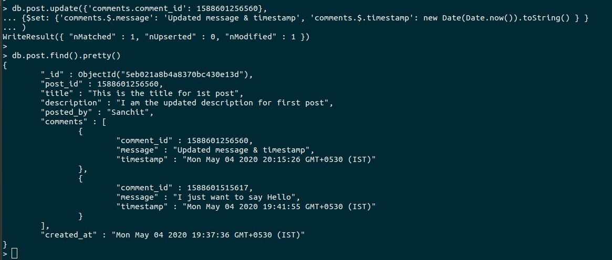

# Day5 - Introduction to NoSQL Database (mongoDB)
**1. Create a Database named 'MYWall'**
  
  

**2. Create two collections named 'user and ''post'**  

**3. Insert some post related information like post_id, title, description , posted_by, comments, created_at etc…**

**4. Comments should be an array of objects which has comment_id, message, timestamp**
 > Ques3 and Ques4 are together

   

**5. Write query to add a new comment for a post** 

**6. Write query to update description of a post**

**7. Write query to update comment message**  

**8. Write query to remove a comment**  

